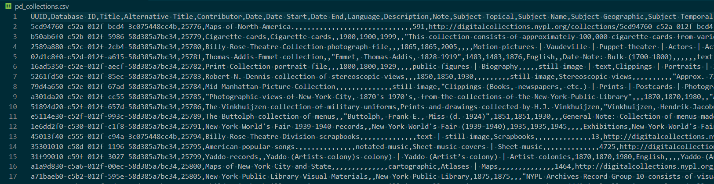
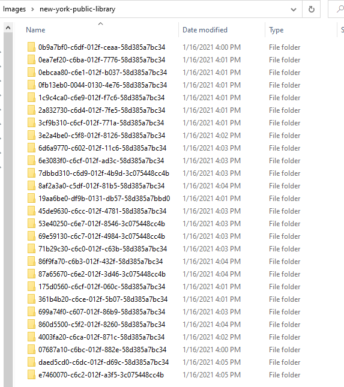
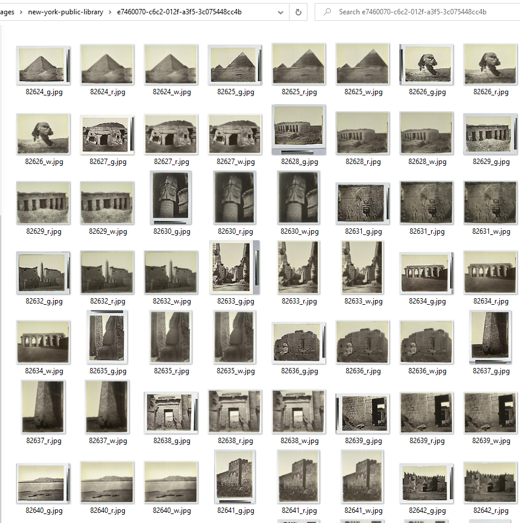

# nypl_pd_collection_grab

New York Public Library API Interface Project in Python

- By Anthony L. Leotta

## Background

The New York Public Library released a Digital Collections API. This project is a POC (Proof-of-Concept) to use that API to search the  New York Public Library digital collections, process the descriptions of each object, and find links to the relevant pages on the NYPL Digital Gallery and then download them.

## What My Program does...

### Create a local database to use for searching.



- The pd_collections.csv is a "database" that saves the collections that the MYPL REST APi returns.
- The format of each row is:

| Key | Value |
| ----- | ----- |
|Alternative Title |  |
|Contributor | Büchner, Georg, 1813-1837 | De Angelis, Enrico |
|Database ID | 25969 |
|Date | 2000 |
|Date End |  |
|Date Start | 1836 |
|Description |  |
|Digital Collections URL | http://digitalcollections.nypl.org/collections/7064c550-c602-012f-79a9-58d385a7bc34 |
|Genre | Books |
|Identifier Accession Number |  |
|Identifier BNumber | b15366833 |
|Identifier Call Number | JFG 02-569 |
|Identifier ISBN | 3598114575 |
|Identifier ISSN |  |
|Identifier Interview ID |  |
|Identifier LCCN |  |
|Identifier OCLC/RLIN | 46487996 |
|Identifier Postcard ID |  |
|Language | German |
|Note | Statement of Responsibility Note: Georg Büchner ; herausgegeben von Enrico De Angelis. |
|Number of Items | 1 |
|Physical Description Extent | 289 p. : facsims. ; 31 cm. + 1 computer optical disc (43/4 in.) |
|Physical Description Form | Facsimiles |
|Place Of Publication | München |
|Publisher | K.G. Saur |
|Resource Type | text | still image |
|Subject Geographic |  |
|Subject Name |  |
|Subject Temporal |  |
|Subject Title |  |
|Subject Topical |  |
|Title | Woyzeck: Faksimile, Transkription, Emendation und Lesetext |
|UUID | 7064c550-c602-012f-79a9-58d385a7bc34 |

### Searchs for a term

The POC takes a term such as "Aegypten" and searches for matches, it then creates a folder with the UUID of the collection and proceeds to download every image.

Top level folders are created.



The sub-folders contain the downloaded images from each collection.




## Setup

1. get an API Key

    Add link here

1. Download and install Anaconda Python

    Follow the offical instructions:

    - [Installation](https://docs.anaconda.com/anaconda/install/)
    - [Installing on Windows](https://docs.anaconda.com/anaconda/install/windows/)
    - [Installing on macOS](https://docs.anaconda.com/anaconda/install/mac-os/)

1. Create a new anaconda Environment

    ```
    conda create --name spider python=3.8
    ```

1. Activate Anaconda Environment

    ```
    conda activate spider
    ```

1. Add PIP Requirements

    ```
    pip install -r requirements.txt
    ```


## References

- [Announcing the NYPL Digital Collections API](https://www.nypl.org/blog/2013/04/04/announcing-nypl-digital-collections-api)

- [API](http://api.repo.nypl.org/)
